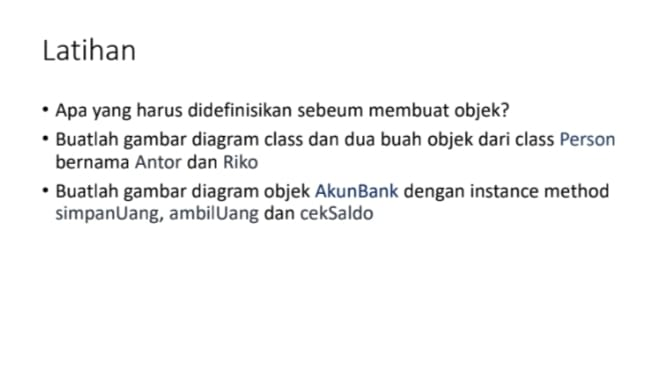

# Tugas Praktikum 2 (Pertemuan ke 3) 

|Nama|NIM|Kelas|Mata Kuliah|
|----|---|-----|------|
|**Radityatama Nugraha**|**312310644**|**TI.23.A6**|**Pemrograman Orientasi Objek**|



# • Apa yang harus didefinisikan sebelum membuat objek?
```
Sebelum membuat objek, kita perlu mendefinisikan class. Class adalah blueprint atau template untuk membuat objek. Class mendefinisikan atribut (data) dan method (perilaku) yang akan dimiliki oleh objek.

Analogi: Bayangkan ingin membuat kue. Sebelum membuat kue (objek), kita butuh resep (class). Resep ini mendefinisikan bahan-bahan (atribut) dan langkah-langkah pembuatan (method).
```
