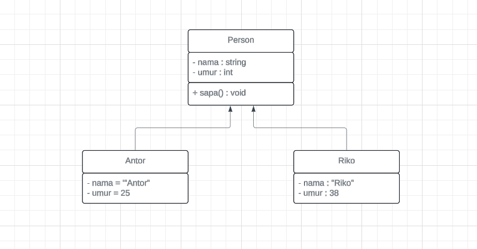
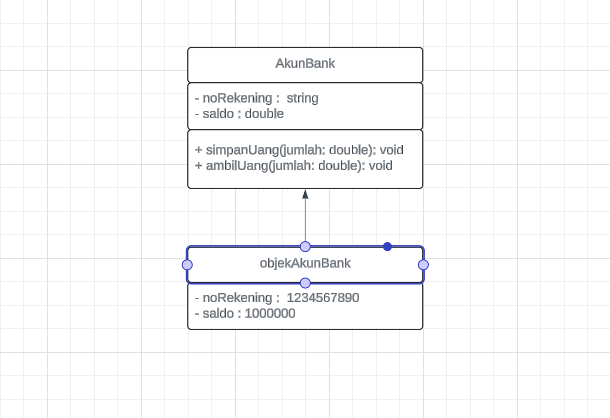

# Tugas Praktikum 2 (Pertemuan ke 3) 

|Nama|NIM|Kelas|Mata Kuliah|
|----|---|-----|------|
|**Radityatama Nugraha**|**312310644**|**TI.23.A6**|**Pemrograman Orientasi Objek**|


# • Apa yang harus didefinisikan sebelum membuat objek?
```
Sebelum membuat objek, kita perlu mendefinisikan class. Class adalah blueprint atau template untuk membuat objek. Class mendefinisikan atribut (data) dan method (perilaku) yang akan dimiliki oleh objek.

Analogi: Bayangkan ingin membuat kue. Sebelum membuat kue (objek), kita butuh resep (class). Resep ini mendefinisikan bahan-bahan (atribut) dan langkah-langkah pembuatan (method).
```

#  • Buatlah gambar diagram class dan dua buah objek dari class Person bernama Antor dan Riko



## Penjelasan :
### Class 'person' :
```
- Memiliki atribut 'nama' (bertipe data string) dan 'umur' (bertipe data integer).
- Memiliki method 'sapa()' yang tidak menerima parameter (void) dan mungkin digunakan untuk menampilkan salam.
```
## Objek 'antor' :
```
- Sebuah instance dari class 'Person' dengan nilai atribut 'nama' = "Antor"' dan 'umur = 25.'
```
### Objek 'riko' :
```
- Sebuah instance dari class 'Person' dengan nilai atribut 'nama = "Riko"' dan 'umur = 30.'
```

#  • Buatlah gambar diagram objek AkunBank dengan instance method simpanUang,ambilUang dan cekSaldo



## Penjelasan :
### Class 'AkunBank' :
```
- Memiliki atribut 'noRekening' (bertipe data string) dan saldo (bertipe data double).
```
```
- Memiliki method 'simpanUang(jumlah: double)' untuk menambahkan saldo.
```
```
- Memiliki method 'ambilUang(jumlah: double)' untuk mengurangi saldo.
```
```
- Memiliki method 'cekSaldo()' untuk menampilkan saldo saat ini.
```

### Objek 'objekAkunBank' :
```
Sebuah instance dari class 'AkunBank' dengan nilai atribut 'noRekening = "1234567890"' dan 'saldo = 1000000.'
```


