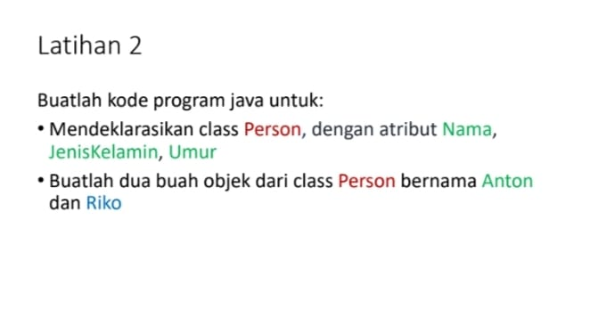

# Tugas Praktikum 2 (Pertemuan ke 3) 

|Nama|NIM|Kelas|Mata Kuliah|
|----|---|-----|------|
|**Radityatama Nugraha**|**312310644**|**TI.23.A6**|**Pemrograman Orientasi Objek**|


# • Apa yang harus didefinisikan sebelum membuat objek?
```
Sebelum membuat objek, kita perlu mendefinisikan class. Class adalah blueprint atau template untuk membuat objek. Class mendefinisikan atribut (data) dan method (perilaku) yang akan dimiliki oleh objek.

Analogi: Bayangkan ingin membuat kue. Sebelum membuat kue (objek), kita butuh resep (class). Resep ini mendefinisikan bahan-bahan (atribut) dan langkah-langkah pembuatan (method).
```

#  • Buatlah gambar diagram class dan dua buah objek dari class Person bernama Antor dan Riko


## Penjelasan :
### Class 'person' :
```
- Memiliki atribut 'nama' (bertipe data string) dan 'umur' (bertipe data integer).
- Memiliki method 'sapa()' yang tidak menerima parameter (void) dan mungkin digunakan untuk menampilkan salam.
```
### Objek 'antor' :
```
- Sebuah instance dari class 'Person' dengan nilai atribut 'nama' = "Antor"' dan 'umur = 25.'
```
### Objek 'riko' :
```
- Sebuah instance dari class 'Person' dengan nilai atribut 'nama = "Riko"' dan 'umur = 30.'
```

#  • Buatlah gambar diagram objek AkunBank dengan instance method simpanUang,ambilUang dan cekSaldo


## Penjelasan :
### Class 'AkunBank' :
```
- Memiliki atribut 'noRekening' (bertipe data string) dan saldo (bertipe data double).
```
```
- Memiliki method 'simpanUang(jumlah: double)' untuk menambahkan saldo.
```
```
- Memiliki method 'ambilUang(jumlah: double)' untuk mengurangi saldo.
```
```
- Memiliki method 'cekSaldo()' untuk menampilkan saldo saat ini.
```

### Objek 'objekAkunBank' :
```
Sebuah instance dari class 'AkunBank' dengan nilai atribut 'noRekening = "1234567890"' dan 'saldo = 1000000.'
```



# Buatlah kode program java untuk :

# • Mendeklarasikan class Person, dengan atribut Nama, JenisKelamin, Umur

# Input Code :
## • Deklarasi kelas 'Person'
```java
public class Person {
    private String nama;
    private int umur;
```
### Penjelasan :
```
- 'public class Person': Menyatakan deklarasi kelas 'Person' yang bersifat publik, artinya bisa diakses dari mana saja.
- 'private String nama;', 'private String jenisKelamin;', dan 'private int umur;': Mendeklarasikan tiga variabel instance '(nama, jenisKelamin, umur)' yang bersifat privat. Karena variabel ini privat, mereka hanya bisa diakses melalui metode getter dan setter dalam kelas 'Person'.
```

## • Constructor Kelas 'Person'
```java
 public Person(String nama, String jenisKelamin, int umur) {
        this.nama = nama;
        this.jenisKelamin = jenisKelamin;
        this.umur = umur;
    }
```
### Penjelasan :
```
- 'public Person(String nama, String jenisKelamin, int umur)': Ini adalah constructor kelas 'Person'. Constructor digunakan untuk menginisialisasi 'nilai' 'nama', 'jenisKelamin', dan 'umur' ketika objek 'Person' dibuat.
- 'this.nama = nama';, 'this.jenisKelamin = jenisKelamin';, dan 'this.umur = umur;': 'this' digunakan untuk membedakan antara variabel instance (yang ada dalam kelas) dan parameter yang diberikan pada constructor. Kode ini mengisi variabel instance dengan nilai yang diberikan saat objek dibuat.
```

## • Getter dan Setter
## Getter dan Setter untuk 'nama' :
```java
public String getNama() {
        return nama;
    }

    public void setNama(String nama) {
        this.nama = nama;
    }
```
### Penjelasan :
```
- 'getNama()': Mengembalikan nilai 'nama'.
- 'setNama(String nama)': Mengubah nilai 'nama' dari objek 'Person'.
```

## Getter dan Setter untuk 'JenisKelamin' :
```java
public String getJenisKelamin() {
        return jenisKelamin;
    }

    public void setJenisKelamin(String jenisKelamin) {
        this.jenisKelamin = jenisKelamin;
    }
```
### Penjelasan :
```
- 'getJenisKelamin()': Mengembalikan nilai 'jenisKelamin'.
- 'setJenisKelamin(String jenisKelamin)': Mengubah nilai 'jenisKelamin' dari objek 'Person'.
 
```

## Getter dan Setter untuk 'umur' :
```java
public int getUmur() {
        return umur;
    }

    public void setUmur(int umur) {
        this.umur = umur;
    }
```
### Penjelasan :
```
- 'getUmur()': Mengembalikan nilai 'umur'.
- 'setUmur(int umur)': Mengubah nilai 'umur' dari objek 'Person'.
```

##  • Method 'main'
```java
public static void main(String[] args) {
        Person Anton = new Person("Anton", "Laki-laki", 25);
        Person Riko = new Person("Riko", "Laki-laki", 30);
```
### Penjelasan :
```
- 'public static void main(String[] args)': Ini adalah method utama yang menjadi titik awal eksekusi program. Pada method ini, objek 'Anton' dan 'Riko' dari kelas 'Person' dibuat.
- 'Person Anton = new Person("Anton", "Laki-laki", 25);': Membuat objek 'Anton' dari kelas 'Person', dengan nilai 'nama' = '"Anton"', 'jenisKelamin' = '"Laki-laki"', dan 'umur' = '25''.
- 'Person Riko = new Person("Riko", "Laki-laki", 30);': Membuat objek 'Riko' dari kelas 'Person', dengan nilai 'nama' = '"Riko"', 'jenisKelamin' = '"Laki-laki"', dan 'umur' = '30'.
```

## • Mencetak informasi ke konsol
### Menampilkan informasi Anton :
```java
        System.out.println("Nama Anton: " + Anton.getNama());
        System.out.println("Jenis Kelamin Anton: " + Anton.getJenisKelamin());
        System.out.println("Umur Anton: " + Anton.getUmur());
```
### Menampilkan informasi Riko :
```java
        System.out.println("Nama Riko: " + Riko.getNama());
        System.out.println("Jenis Kelamin Riko: " + Riko.getJenisKelamin());
        System.out.println("Umur Riko: " + Riko.getUmur());
    }
}
```
### Penjelasan :
```
- 'System.out.println("Nama Anton: " + Anton.getNama());': Mengambil nilai 'nama' dari objek 'Anton' dengan menggunakan metode getter 'getNama()' dan mencetaknya ke konsol.
- 'System.out.println("Jenis Kelamin Anton: " + Anton.getJenisKelamin());': Mengambil nilai 'jenisKelamin' dari objek 'Anton' dengan metode 'getJenisKelamin()'.
- 'System.out.println("Umur Anton: " + Anton.getUmur());': Mengambil nilai 'umur dari objek 'Anton' dengan metode 'getUmur()'.
```

# Output :


# • Buatlah dua buah objek dari class Person bernama Anton dan Riko

### Penjelasan :
```
Anton dan Riko adalah dua objek yang dibuat dari class 'Person'.

- Anton memiliki nilai '"Anton"', '"Laki-laki"', dan '25' untuk atribut 'nama', 'jenisKelamin', dan 'umur'.
- Riko memiliki nilai '"Riko"', '"Laki-laki"', dan '30' untuk atribut 'nama', 'jenisKelamin', dan 'umur'.
```
